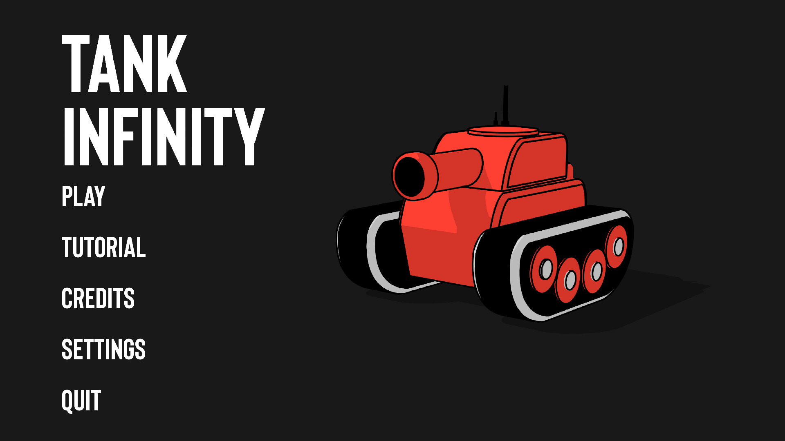
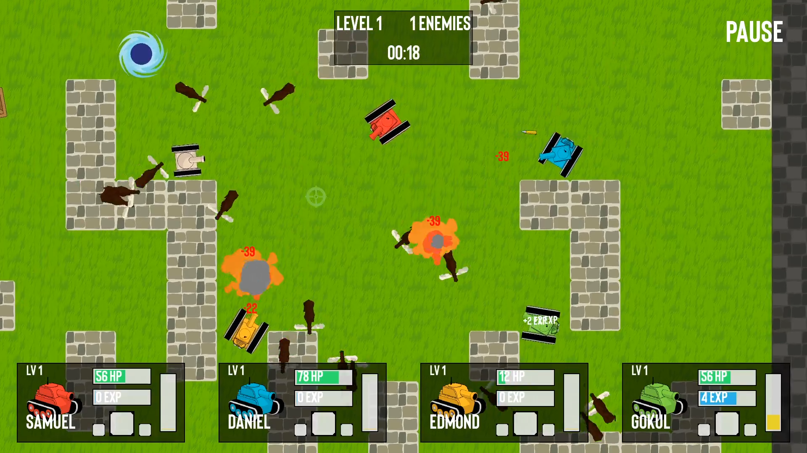
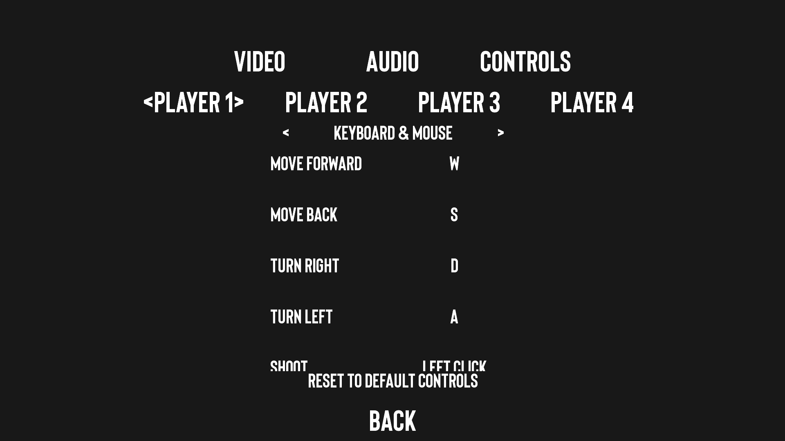
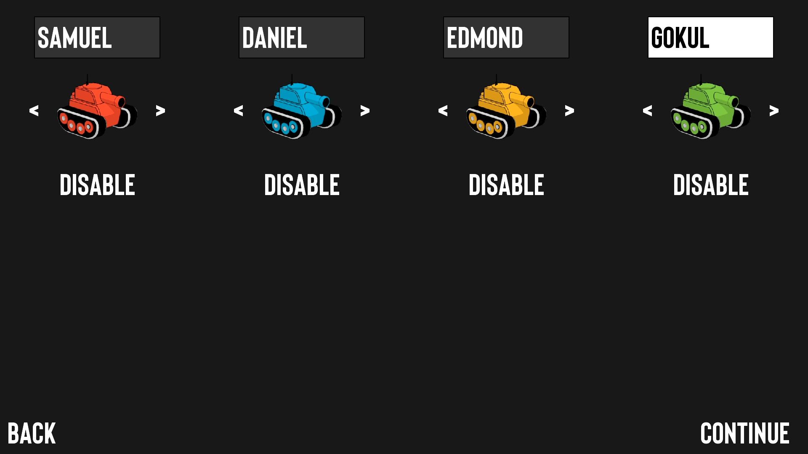
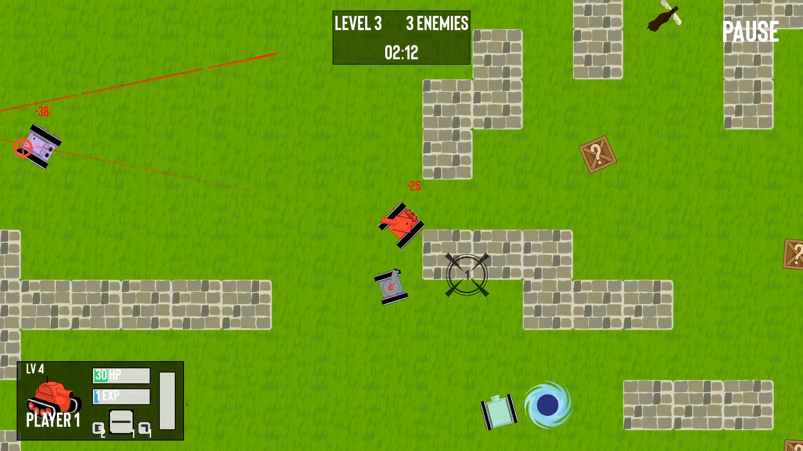
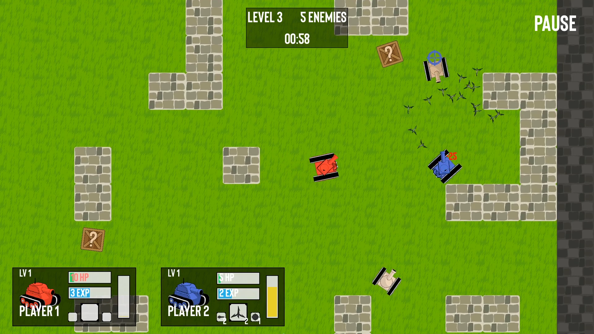
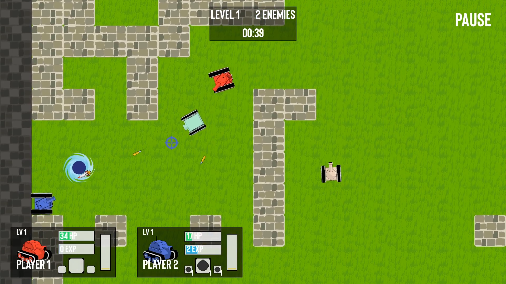
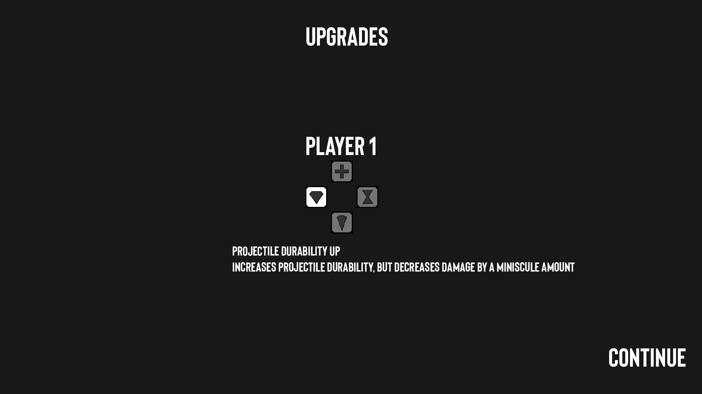
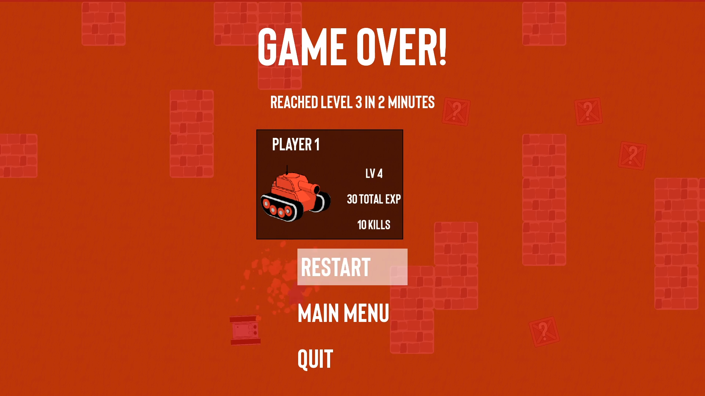

# Tank Infinity

*Tank Infinity* is an infinite level progression tank game. Players go through levels fighting tanks, upgrading, and eventually losing. You can find a more detailed tutorial from the main menu.

## [Play the latest release!](https://github.com/The-Church-of-Daniel-Pham/TankInfinity/releases/latest)



## Features

#### Play locally with up to four players, using mouse and keyboard or controllers


#### Customize your controls


#### Name your players and select your favorite colors


#### Face several classes of AI enemies


#### Pick up powerful items and cycle between them


#### Find the portal to escape to the next level


#### Upgrade your tank after gaining XP


#### Track your progress and try to advance as far as you can



## Authors

This game was the final project in our AP Computer Science class in 2018 taught by Mr. Dunlea. It was designed and completed over the span of one month.

* [Samuel Hunter](https://github.com/SamuelHunter)
* [Edmond Fang](https://github.com/seikurou)
* [Daniel Pham](https://github.com/danielpham172)
* [Gokul Swaminathan](https://github.com/JavaCafe01)

## Special Thanks

<a href='https://libgdx.badlogicgames.com/'></a>

## License

Tank Infinity is made available under the terms of the [MIT License](https://opensource.org/licenses/MIT).

```
MIT License

Copyright (c) 2018 The Church of Daniel Pham

Permission is hereby granted, free of charge, to any person obtaining a copy
of this software and associated documentation files (the "Software"), to deal
in the Software without restriction, including without limitation the rights
to use, copy, modify, merge, publish, distribute, sublicense, and/or sell
copies of the Software, and to permit persons to whom the Software is
furnished to do so, subject to the following conditions:

The above copyright notice and this permission notice shall be included in all
copies or substantial portions of the Software.

THE SOFTWARE IS PROVIDED "AS IS", WITHOUT WARRANTY OF ANY KIND, EXPRESS OR
IMPLIED, INCLUDING BUT NOT LIMITED TO THE WARRANTIES OF MERCHANTABILITY,
FITNESS FOR A PARTICULAR PURPOSE AND NONINFRINGEMENT. IN NO EVENT SHALL THE
AUTHORS OR COPYRIGHT HOLDERS BE LIABLE FOR ANY CLAIM, DAMAGES OR OTHER
LIABILITY, WHETHER IN AN ACTION OF CONTRACT, TORT OR OTHERWISE, ARISING FROM,
OUT OF OR IN CONNECTION WITH THE SOFTWARE OR THE USE OR OTHER DEALINGS IN THE
SOFTWARE.
```
